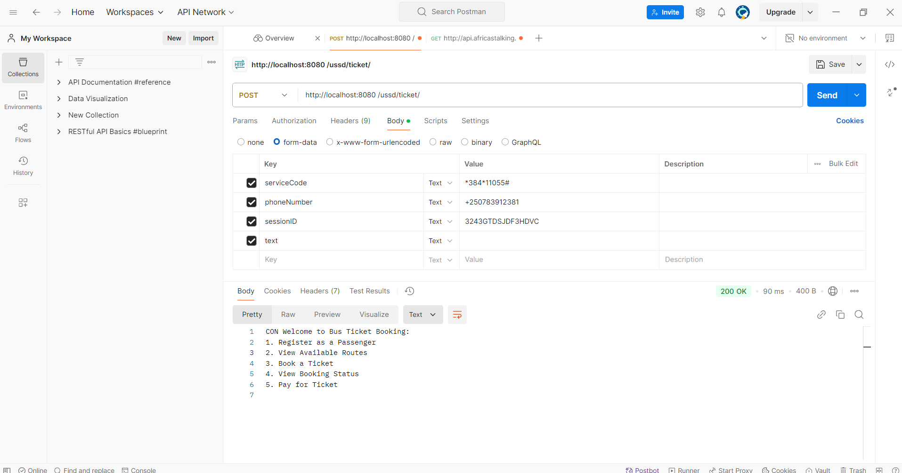
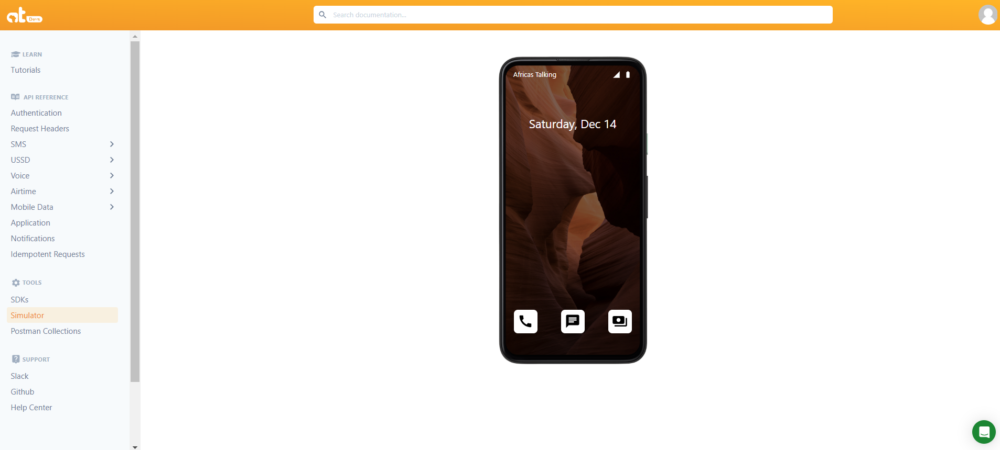
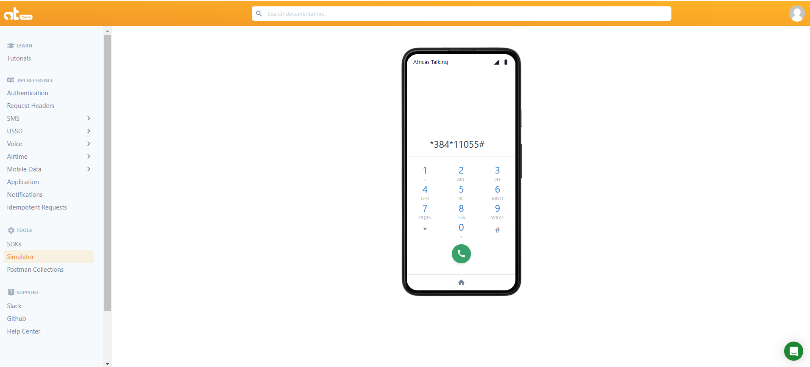
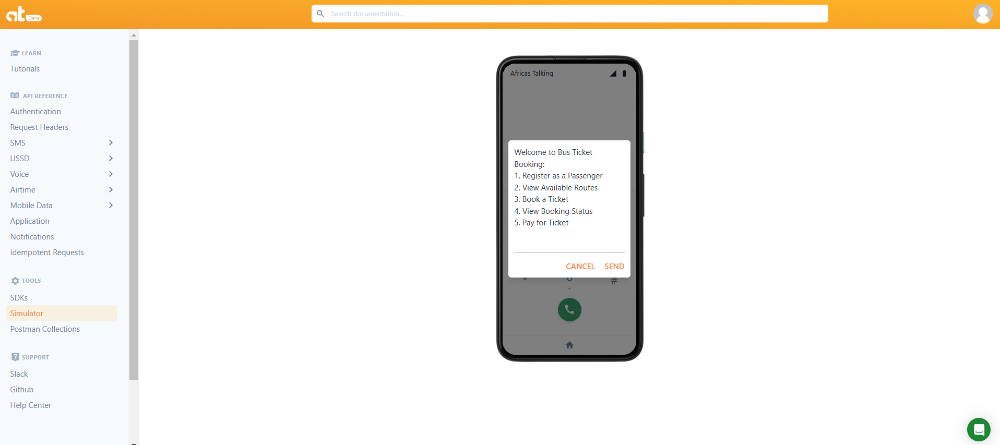

# Bus Ticket Booking System

A USSD-based system for booking and managing bus tickets. Built with PHP and Africa's Talking API for SMS functionality.

#### Basic Features
* Register as a passenger. 
* View available routes and ticket prices.
* Book tickets and receive ticket codes.
* Check booking status.

#### Additional Features
* Multi-level USSD menu navigation.
* SMS notifications for registrations and ticket bookings.
* User-friendly system for managing routes, tickets, and payments.

### Prerequisites

Africa's Talking API credentials
MySQL database

## Start Service

Postman App or Simulation 

### Some Screenshots

